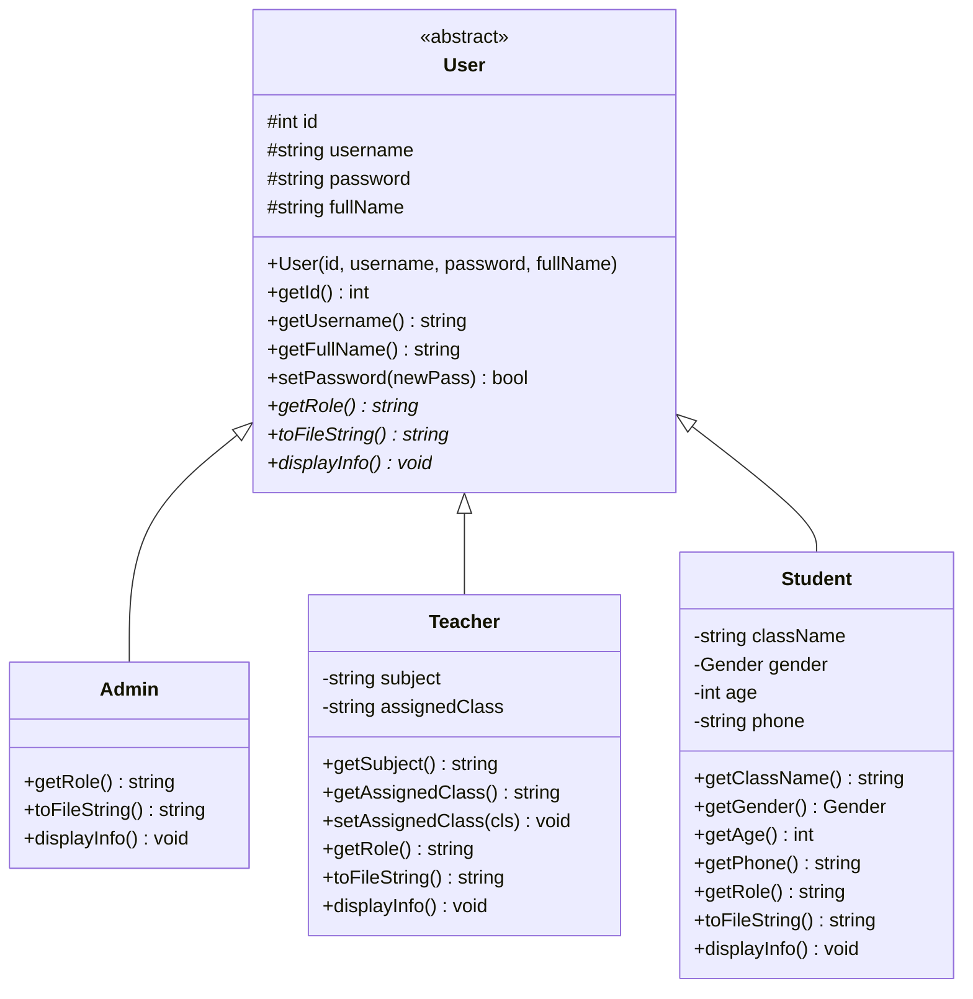
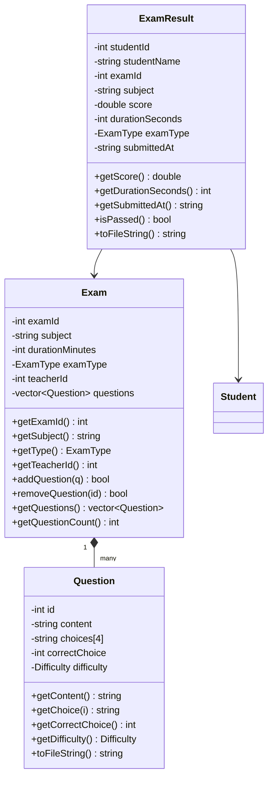
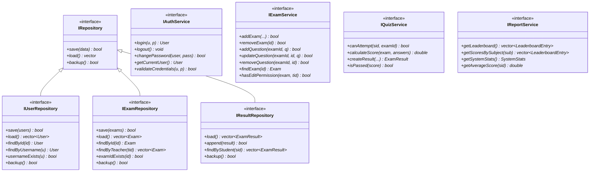
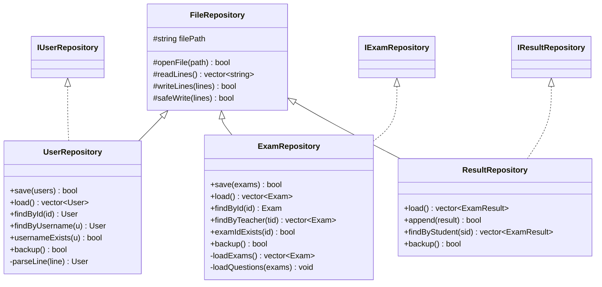
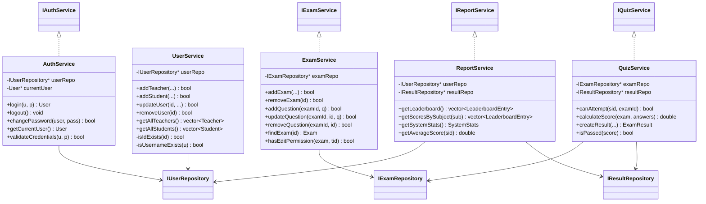

# Class Diagram

## 1. Model Hierarchy — Kế thừa từ User

---

## 2. Exam & Question

---

## 3. Interface Layer

---

## 4. Repository Layer — Implement Interfaces

---

## 5. Service Layer — Implement Interfaces

---

## 6. UI Layer

```mermaid
classDiagram
    class LoginScreen {
        -IAuthService* authService
        +show() User
    }

    class ExamScreen {
        -IQuizService* quizService
        -IExamRepository* examRepo
        -IResultRepository* resultRepo
        +show(student, exam) void
        -displayQuestion(q, index) void
        -collectAnswers(exam) vector~int~
        -measureTime() int
    }

    class ResultScreen {
        -IReportService* reportService
        +showResult(result) void
        +showHistory(results) void
        +showLeaderboard(entries) void
    }

    class AdminMenu {
        -IUserService* userService
        -IExamService* examService
        -IReportService* reportService
        +show(admin) void
    }

    class TeacherMenu {
        -IExamService* examService
        -IReportService* reportService
        +show(teacher) void
    }

    class StudentMenu {
        -IQuizService* quizService
        -IExamRepository* examRepo
        +show(student) void
    }

    class InputHelper {
        +readInt(prompt)$ int
        +readIntInRange(prompt, min, max)$ int
        +readLine(prompt)$ string
        +isValidUsername(s)$ bool
        +isValidPassword(s)$ bool
        +isValidPhone(s)$ bool
    }

    class TableRenderer {
        +printTable(headers, rows)$ void
        +printSeparator(width)$ void
    }

    class ColorPrinter {
        +printSuccess(msg)$ void
        +printError(msg)$ void
        +printWarning(msg)$ void
        +printHighlight(msg)$ void
    }

    AdminMenu --> IExamService
    TeacherMenu --> IExamService
    StudentMenu --> IQuizService
    ExamScreen --> IQuizService
    ResultScreen --> IReportService
    LoginScreen --> IAuthService
```

